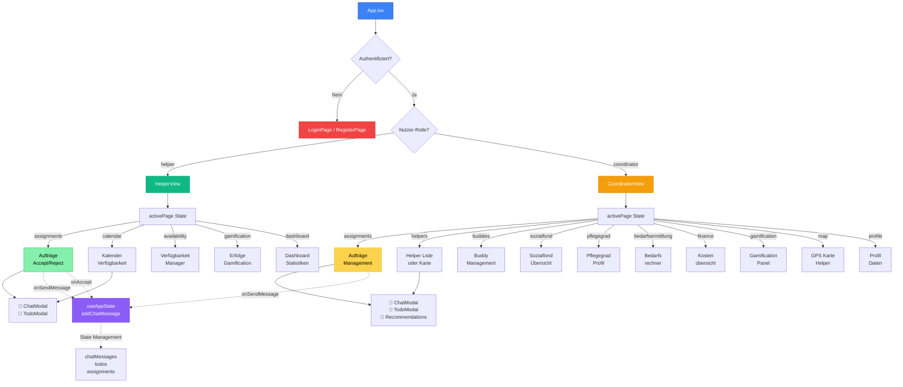

# CareConnect - Routing & Struktur Diagramm

## Flussdiagramm der Anwendung



## Beschreibung

### Authentifizierung
- **LoginPage**: Existierende Nutzer melden sich an
- **RegisterPage**: Neue Nutzer können sich registrieren
- Nach erfolgreicher Authentifizierung wird die Rolle geprüft

### Rollen-basierte Views

#### HelperView (🟢 Helfer)
Nutzer mit Rolle `helper` sehen folgende Tabs:
- **assignments**: Verfügbare Aufträge, Accept/Reject
- **calendar**: Kalender der Aufträge
- **availability**: Verfügbarkeitszeiten verwalten
- **gamification**: Erfolge und Punkte
- **dashboard**: Statistiken und Überblick

**Modals**:
- ChatModal: Kommunikation über Aufträge
- TodoModal: Checklisten für Aufträge

#### CoordinatorView (🟡 Koordinator)
Nutzer mit Rolle `coordinator` sehen 11 verschiedene Seiten:
- **assignments**: Auftragsverwaltung (erstellen, zuweisen)
- **helpers**: Liste der Helper (mit Map-Option)
- **buddies**: Buddy-Beziehungen verwalten
- **sozialfond**: Übersicht Sozialfond-Beiträge
- **pflegegrad**: Pflegegradprofil
- **bedarfsermittlung**: Bedarfsrechner
- **finance**: Finanzübersicht
- **gamification**: Gamification-Daten
- **map**: GPS-Karte der Helper
- **profile**: Profilseite

**Modals**:
- ChatModal: Mit Helfern kommunizieren
- TodoModal: Aufgabenverwaltung
- HelperRecommendations: Helfer für Auftrag empfehlen

### State Management (🟣)

Der zentrale `useAppState` Hook verwaltet:
- `chatMessages`: Nachrichten pro Auftrag
- `todos`: Aufgabenlisten
- `assignments`: Alle Aufträge
- `users`: Alle Nutzer
- `files`: Hochgeladene Dateien
- `finances`, `costEntries`: Finanzielle Daten
- Und weitere spezifische States

## Aufruf online visualisieren

Kopiere den Mermaid-Code (zwischen den ` ``` `Markierungen) und füge ihn hier ein:
- **Mermaid Live Editor**: https://mermaid.live/
- **Mermaid.js Offline**: Markdown-Viewer mit Mermaid-Support (z.B. VS Code Extension)

## Navigation im Code

```
src/
├── App.tsx                    ← Hauptrouting & Auth-Check
├── pages/
│   ├── HelperView.tsx         ← Helper-Navigation
│   └── CoordinatorView.tsx    ← Coordinator-Navigation
├── components/
│   ├── LoginPage.tsx
│   ├── RegisterPage.tsx
│   ├── ChatModal.tsx
│   ├── TodoModal.tsx
│   └── [weitere Components]
├── hooks/
│   └── useAppState.ts         ← Zentrale State Management
└── types/
    └── index.ts               ← Datenstrukturen
```
